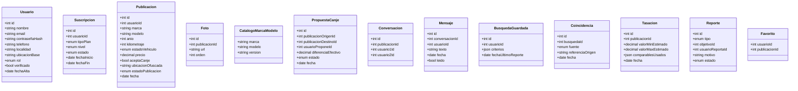

# Diagrama de clases — modelo de datos

Entidades de la sección 2.1 de [arquitectura-y-modelo.md](arquitectura-y-modelo.md), sin relaciones.

```mermaid
classDiagram
    class Usuario {
        +int id
        +string nombre
        +string email
        +string contraseñaHash
        +string telefono
        +string localidad
        +string ubicacionBase
        +enum rol
        +bool verificado
        +date fechaAlta
    }
    class Suscripcion {
        +int id
        +int usuarioId
        +enum tipoPlan
        +enum nivel
        +enum estado
        +date fechaInicio
        +date fechaFin
    }
    class Publicacion {
        +int id
        +int usuarioId
        +string marca
        +string modelo
        +int anio
        +int kilometraje
        +enum estadoVehiculo
        +decimal precio
        +bool aceptaCanje
        +string ubicacionOfuscada
        +enum estadoPublicacion
        +date fecha
    }
    class Foto {
        +int id
        +int publicacionId
        +string url
        +int orden
    }
    class CatalogoMarcaModelo {
        +string marca
        +string modelo
        +string version
    }
    class PropuestaCanje {
        +int id
        +int publicacionOrigenId
        +int publicacionDestinoId
        +int usuarioProponeId
        +decimal diferenciaEfectivo
        +enum estado
        +date fecha
    }
    class Conversacion {
        +int id
        +int publicacionId
        +int usuario1Id
        +int usuario2Id
    }
    class Mensaje {
        +int id
        +int conversacionId
        +int usuarioId
        +string texto
        +date fecha
        +bool leido
    }
    class BusquedaGuardada {
        +int id
        +int usuarioId
        +json criterios
        +date fechaUltimoReporte
    }
    class Coincidencia {
        +int id
        +int busquedaId
        +enum fuente
        +string referenciaOrigen
        +date fecha
    }
    class Tasacion {
        +int id
        +int publicacionId
        +decimal valorMinEstimado
        +decimal valorMaxEstimado
        +json comparablesUsados
        +date fecha
    }
    class Reporte {
        +int id
        +enum tipo
        +int objetivoId
        +int usuarioReportaId
        +string motivo
        +enum estado
    }
    class Favorito {
        +int usuarioId
        +int publicacionId
    }
```
